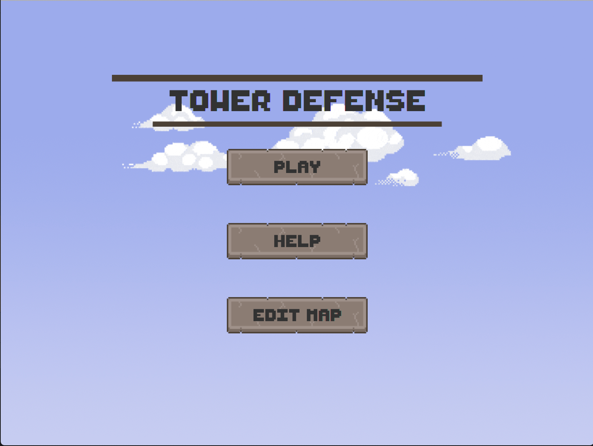
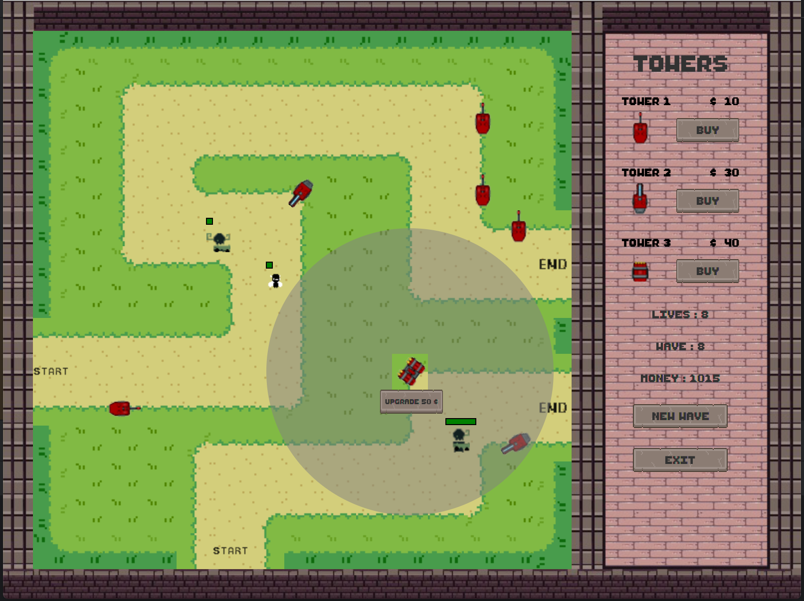
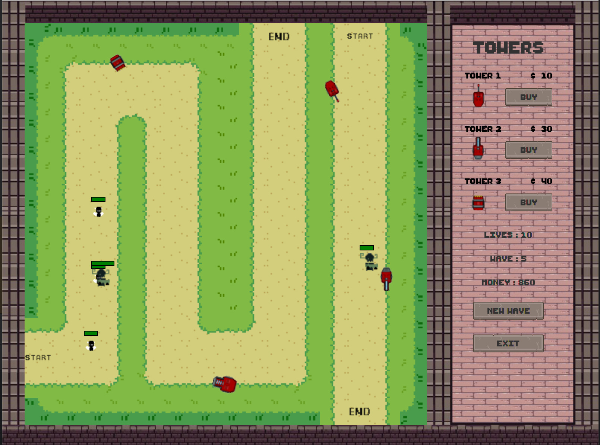
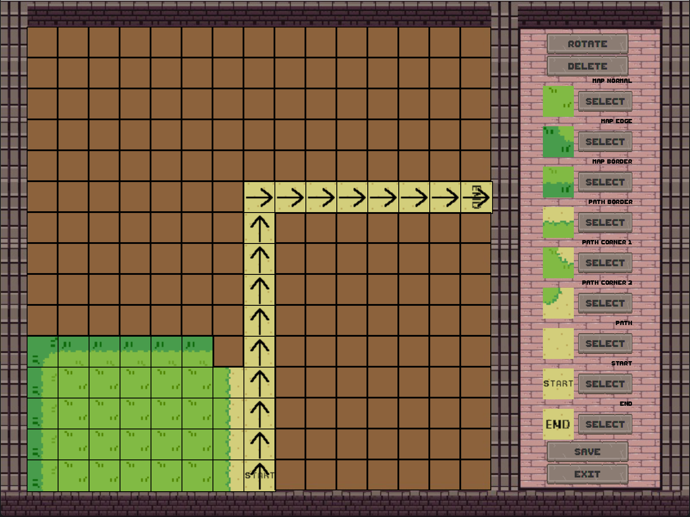

# Tower Defense Game Overview

This Tower Defense game, developed in Java, challenges players to survive numerous waves of diverse monsters by strategically placing and upgrading various 
weapons across multiple maps. Each monster possesses unique speed and health attributes, adding complexity to the defense strategy. 
Players earn in-game currency by defeating monsters, which can be used to upgrade weapons and enhance their defense capabilities. 
A standout feature of the game is the ability for players to design their own maps, offering a personalized gaming experience and endless replayability.

##

